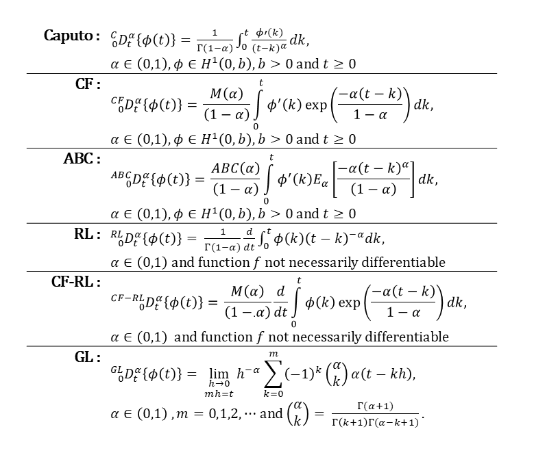

# A-Bayesian-Fractional-Order-Model-Selection-Method
Supplementary code for the paper **Deciphering Memory Patterns in Eco-Epidemiological systems through the lens of BaFOMS: A Bayesian Fractional Order Model Selection Method**. We have submitted this paper to _Nature Computational Science_. We will share the link here to review if the paper is accepted and published.

# Overview of work
Fractional derivatives (FDs) are a generalization of classical integer-order derivatives and there are many ways to define a FD. This results in the existence of various FD definitions in the literature. FDs offer a powerful tool to model complex systems in various fields such as environmental sciences, physics, and biology. However, choosing a suitable FD definition is not always straightforward, as different FD definitions exhibit unique properties that can significantly impact the analysis results. Despite their theoretical significance, there is a gap in the literature regarding the data-driven selection of the most appropriate FD definition. This study addresses this gap by exploring the efficacy of six FD definitions based on simulated and real data, aiming to identify the optimal definition that aligns with the underlying process.

We have considered a simple fractional order initial value logistic growth model

$${}_{0}^{}D_t^\alpha \{N(t)\} = r N(t) \left( 1 - \frac{N(t)}{K} \right), \quad r > 0 \, \alpha \in (0, 1]$$ 

with initial population size, $$N(t_0) = N_{t_0}$$ and $$N(t)$$ represents the population size at time $$t$$; $$r$$ is the intrinsic rate of growth; $$K$$ is the carrying capacity of the system; and  $${}_{0}^{}D_t^\alpha$$  can be interpreted using any one of the FD's described as follows;

  

The complete workflow of our work to determine the suitable FD definition for the analysis based on the data is as follows;

1. First, we have considered the six FD definitions for the study and considered six logistic FDEs based on these definitions.
2. The numerical solution is obtained using different numerical schemes.
3. By adding the noise to this solution, corresponding statistical models have been obtained.
4. Under Bayesian framework, the posterior distribution of model parameters is obtained using JAGS and in final step the Bayesian model selection is performed using the RJMCMC method.
5. RJMCMC provides posterior model probabilities as a result and FD corresponding to the highest posterior model probability is the optimal.

We have first performed the simulation study and then explored the nature of memory using six commonly employed fractional derivatives (FDs) across three ecological datasets—population time series of two mammalian species, *Ursus americanus* and *Castor canadensis*, and one avian species, *Phalacrocorax carbo*—along with an epidemiological dataset focusing on COVID-19 cases in Germany following logistic growth curve. All the analyses are carried out in the **R** software. All the code files used in this study are organized within the main folder titled **Data Analysis Mestry et al 2024**. This folder is divided into two sub-folders: **SIMULATION STUDY** for simulated data analysis and **REAL DATA STUDY** for real data analysis. The analysis includes two primary datasets, the Global Population Dynamics Database (GPDD) and COVID-19, with corresponding code files located in the **CASE STUDY I_GPDD** and **CASE STUDY II_COVID_19** folders, respectively. Within the GPDD case study, three species datasets—__Ursus americanus__ (GPDD ID:116), __Castor canadensis__ (GPDD ID:200), and __Phalacrocorax carbo__ (GPDD ID:9330) are analyzed, with relevant code files stored in the sub-folders **GPDD_116**, **GPDD_200**, and **GPDD_9330**. For the COVID-19 case study, data for Germany is analyzed, with the corresponding code files located in the **Germany** sub-folder within **CASE STUDY II_COVID_19**. The flowchart for accessing the code files is depicted in the following Figure 1.

  
  
<em>Figure 1: Flowchart for accessing the R code files.</em>

